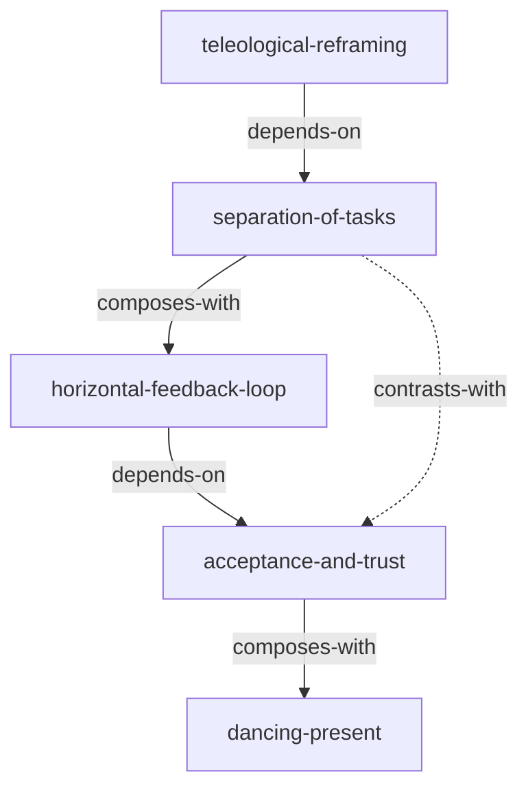

# 《被讨厌的勇气》 — Skill Index

> 本书由 cangjie-skill 蒸馏, 共产出 **5** 个 skills。
> 处理时间: 2026-08-24

## 关于这本书

- **作者**: 【日】岸见一郎；古贺史健
- **出版年**: 2015
- **一句话主旨**: 通过否定原因论并倡导目的论、人际课题分离、共同体感觉以及活在当下的智慧，帮助个体摆脱过去的束缚、人际关系的枷锁，勇敢追求属于自己的幸福与自由。
- **整书理解**: 见 [BOOK_OVERVIEW.md](./BOOK_OVERVIEW.md)
- **精华长文** (不读全书看这篇): [DIGEST.md](./DIGEST.md) (待生成)
- **术语词典**: [GLOSSARY.md](./GLOSSARY.md)

---

## Skill 列表 (按主题分组)

### 破除心理受害者枷锁

- [`teleological-reframing`](./teleological-reframing/SKILL.md) — 目的论重构：通过逆向识别“当前情绪/拖延是为了什么目的”，找回行为主导权。

### 人际关系与边界设定

- [`separation-of-tasks`](./separation-of-tasks/SKILL.md) — 课题分离矩阵：解决人际内耗、划定责任边界的反直觉法则（应对干涉、逼迫、越界）。
- [`horizontal-feedback-loop`](./horizontal-feedback-loop/SKILL.md) — 横向沟通法：摒弃本质上是操纵的“表扬”与“批评”，建立“虽不同但平等”的鼓励机制。

### 存在主义与行动效能

- [`acceptance-and-trust`](./acceptance-and-trust/SKILL.md) — 自我接纳与他者信赖：放下有条件的“信用”，无条件“信赖”他人，在被背叛时依然能接纳自我。
- [`dancing-present`](./dancing-present/SKILL.md) — 刹那舞步：反对“延迟满足”的线性人生规划，将注意力打向此时此刻，缓解长期焦虑。

---

## 引用图



图例:
- `-->`  depends-on
- `-.->` contrasts-with
- `===>` composes-with

---

## 推荐学习顺序

(从依赖图的底层节点开始，逐层向上构建阿德勒心理学实践闭环)

1. **teleological-reframing** — 最基础。从否定原因论开始，拿回个人行动和解释的自主权。
2. **separation-of-tasks** — 核心解药。有了自主权后，学会划定自我与他人的界限，不被他人情绪绑架。
3. **horizontal-feedback-loop** — 组合应用。在分离课题的基础上，开展不越界、平等的横向沟通与鼓励。
4. **acceptance-and-trust** — 进阶前提。要真正进入更大的共同体，不仅需要分离，更需要无条件接纳自我和信赖他人。
5. **dancing-present** — 终极应用。在建立信赖与共同体感觉之后，放弃焦虑的线性追求，享受当下的“刹那”。

---

## 安装使用

本目录是构建产物, 宿主不会从这里加载 skill。要让 agent 真正调用, 把 skill 目录复制到宿主的 skills 目录:

```bash
# 用户级 (所有项目可用)
cp -r books/courage-to-be-disliked/separation-of-tasks ~/.gemini/skills/
cp -r books/courage-to-be-disliked/teleological-reframing ~/.gemini/skills/
cp -r books/courage-to-be-disliked/horizontal-feedback-loop ~/.gemini/skills/
cp -r books/courage-to-be-disliked/acceptance-and-trust ~/.gemini/skills/
cp -r books/courage-to-be-disliked/dancing-present ~/.gemini/skills/
```

---

## 接入 darwin-skill

所有 skill 均带有 `test-prompts.json` (darwin-skill 兼容格式), 可直接接入自动进化:

```
darwin evolve books/courage-to-be-disliked/
```

---

## 审计轨迹

- 候选单元池: [candidates/](./candidates/)
- 被淘汰的候选 (含原因): [rejected/](./rejected/)
- BOOK_OVERVIEW: [BOOK_OVERVIEW.md](./BOOK_OVERVIEW.md)
